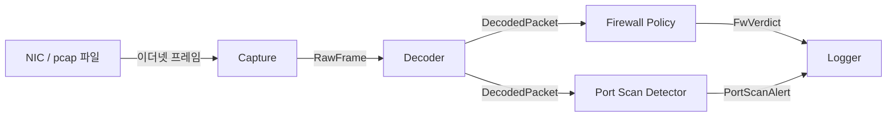

# Mini UTM


네트워크 트래픽을 캡처해서 **방화벽 정책 위반**과 **포트 스캔**을 탐지하고 로그로 남기는
작은 UTM(Unified Threat Management) 엔진입니다. 트래픽을 차단하지 않고 복사본만 관찰하는
**Detection Only** 방식으로 동작합니다.

```text
2026-09-29 14:03:21.519 [FW]       dir=IN  rule=default action=DENY  198.51.100.7:51234 -> 10.1.1.55:3306 (detect only, not blocked)
2026-09-29 14:03:21.733 [FW]       dir=OUT rule=#3      action=DENY  10.1.1.20:40112 -> 203.0.113.10:4444 (detect only, not blocked)
2026-09-29 14:03:22.107 [PORTSCAN] 198.51.100.7 -> 10.1.1.55 distinct_ports=10 window=1s
```
<sub>목표 출력 형식 (DESIGN 6장). 로그 출력은 아직 구현 중입니다.</sub>

## 특징

- **Firewall Policy**: 내부망 대역(`home_net`)으로 방향(Inbound/Outbound)을 판별하고, 목적지 IP·Port를 정책과 First Match로 비교
- **Port Scan Detection**: 같은 출발지가 1초 안에 같은 목적지의 서로 다른 Port 10개 이상에 연결을 시도하면 탐지 (슬라이딩 윈도우)
- **연결 시도만 분석**: SYN(ACK 없음) 패킷만 판단 대상으로 삼아 세션당 한 번만 판단
- **Evasion / Insertion을 고려한 해석**: IP 패킷의 끝을 Total Length로 판단해 이더넷 패딩이나 덧붙인 바이트를 TCP 헤더로 오인하지 않음
- **실시간 캡처와 pcap 재생**: 같은 입력으로 탐지 결과를 반복해서 확인 가능
- **종료 통계**: 수신·해석·제외 사유별 개수와 커널 누락 수로 "탐지할 게 없었는지, 보지 못했는지"를 구분

## 동작 구조



단일 스레드로, 프레임 하나가 캡처부터 로그 출력까지 한 흐름 안에서 처리됩니다.
Decoder가 해석하지 못하거나 분석 대상이 아닌 프레임은 사유별로 집계만 하고 제외합니다.

## 구현 현황

| Component | 상태 | 테스트 |
| --- | --- | --- |
| Capture (libpcap 실시간 캡처 / pcap 재생) | ✅ 완료 | ✅ |
| Decoder (Ethernet → IPv4 → TCP) | ✅ 완료 | ✅ |
| Config (설정 파일 해석) | ✅ 완료 | ✅ |
| Firewall Policy | ✅ 완료 | ✅ |
| Port Scan Detector | ✅ 완료 | ✅ |
| Logger | ✅ 완료 | ✅ |

## 시작하기

### 요구 사항

- Linux, g++ 11 이상 (C++20)
- CMake 3.20 이상
- libpcap 개발 패키지, Catch2 v2 (테스트)

```bash
sudo apt install build-essential cmake libpcap-dev catch2
```

### 빌드

```bash
cmake -S . -B build
cmake --build build
```

결과물은 `build/mini_utm`(프로그램)과 `build/unit_tests`(테스트)입니다.

### 실행

```bash
# pcap 파일 재생
./build/mini_utm -r tests/data/sample.pcap -c config/mini_utm.conf

# 실시간 캡처 (캡처 권한 필요)
sudo ./build/mini_utm -i <interface> -c config/mini_utm.conf
```

| 옵션 | 설명 |
| --- | --- |
| `-i <interface>` | 네트워크 인터페이스에서 실시간 캡처 |
| `-r <pcap_file>` | pcap 파일 재생 |
| `-c <config_file>` | 설정 파일 (필수) |

`-i`와 `-r` 중 정확히 하나를 지정합니다. `Ctrl+C`(`SIGINT`)나 `SIGTERM`을 받으면 처리 중이던 프레임을 마친 뒤 종료 통계를 출력하고 끝납니다.

실시간 캡처는 스위치의 미러 포트(SPAN)나 네트워크 TAP에 연결된 인터페이스에서 실행하는 것을 전제로 합니다.

### 설정 파일

```text
home_net 10.0.0.0/8
home_net 192.168.0.0/16

fw allow 10.1.1.55:8090
fw deny  203.0.113.10:4444
```

| 줄 | 의미 |
| --- | --- |
| `home_net <cidr>` | 내부망 대역. 없으면 RFC 1918 사설 대역 사용 |
| `fw <allow\|deny> <ip>:<port>` | 목적지 IP·Port 정책. 위에서부터 처음 일치한 정책 적용 |

정책에 일치하지 않으면 Inbound는 Deny, Outbound는 Allow로 판정합니다.
로그는 Deny 판정만 출력하고, `allow` 정책에 일치한 연결은 종료 통계의 `fw_allowed`로 개수만 셉니다.

## 테스트

```bash
ctest --test-dir build --output-on-failure
```

[Catch2](https://github.com/catchorg/Catch2)로 작성했습니다. Decoder는 정상 SYN 프레임을 코드로 조립한 뒤
한 바이트씩 변조해 제외 사유를 하나씩 확인하고, 재생 테스트에는
[`tests/data/make_sample_pcap.py`](tests/data/make_sample_pcap.py)로 생성한 pcap을 사용합니다.

## 프로젝트 구조

```text
mini-utm/
├── src/
│   ├── main.cpp            조립, 프레임 콜백, 시그널 처리
│   ├── capture.*           libpcap 핸들 (RAII), RawFrame
│   ├── decoder.*           Ethernet / IPv4 / TCP 해석
│   ├── config.*            설정 파일
│   ├── firewall.*          방화벽 정책
│   ├── portscan.*          포트 스캔 탐지
│   └── logger.*            로그, 종료 통계
├── tests/                  Catch2 테스트, 테스트 데이터
├── config/                 설정 파일 예시
├── docs/
│   ├── DESIGN.md           무엇을, 왜 (동작과 탐지 정책)
│   └── SPEC.md             어떻게 (클래스, 시그니처, 호출 흐름)
└── CMakeLists.txt
```

## 문서

- [DESIGN.md](docs/DESIGN.md): 목적과 범위, Component 책임, 탐지 규칙, 한계와 향후 확장
- [SPEC.md](docs/SPEC.md): 코드 구조, 데이터 타입, 클래스 명세, 호출 흐름, 에러 처리

## 한계

IPv4/TCP만 분석하며 IPv6, UDP, VLAN, IP 재조립, 체크섬 검증은 지원하지 않습니다.
느린 스캔, 분산 스캔, FIN/NULL/Xmas 스캔 등 탐지하지 못하는 경우는 [DESIGN 7장](docs/DESIGN.md#7-한계)에 정리했습니다.
