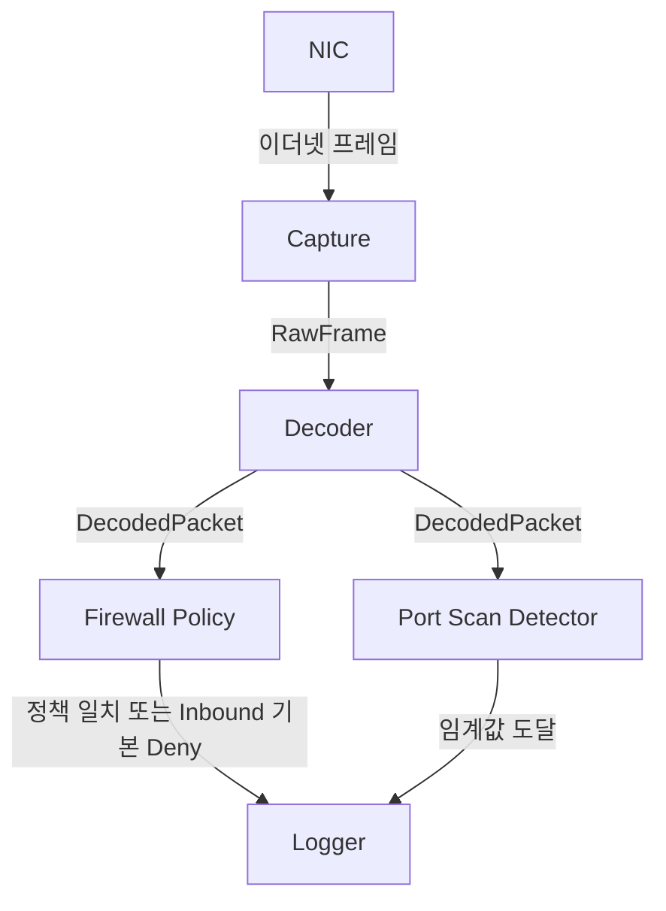

# Mini UTM Design

이 문서는 Mini UTM의 목적과 범위, 구성 Component와 각 Component의 책임,
그리고 탐지 정책의 동작 방식에 관하여 기술한다.

## 목차

- [1. 개요](#1-개요)
  - [1.1 목적](#11-목적)
  - [1.2 범위](#12-범위)
  - [1.3 동작 방식](#13-동작-방식)
- [2. 아키텍처](#2-아키텍처)
  - [2.1 구성](#21-구성)
  - [2.2 처리 흐름](#22-처리-흐름)
  - [2.3 시작과 종료](#23-시작과-종료)
- [3. Capture](#3-capture)
- [4. Decoder](#4-decoder)
  - [4.1 Decode Ethernet](#41-decode-ethernet)
  - [4.2 Decode IPv4](#42-decode-ipv4)
  - [4.3 Decode TCP](#43-decode-tcp)
  - [4.4 DecodedPacket](#44-decodedpacket)
- [5. Detection](#5-detection)
  - [5.1 Firewall Policy](#51-firewall-policy)
  - [5.2 Port Scan Detector](#52-port-scan-detector)
- [6. Logging](#6-logging)
- [7. 한계](#7-한계)
  - [7.1 탐지 우회와 오탐 유발](#71-탐지-우회와-오탐-유발)
  - [7.2 지원 범위](#72-지원-범위)
  - [7.3 상태 관리와 로그](#73-상태-관리와-로그)
- [8. 향후 확장](#8-향후-확장)
  - [8.1 Host Scan Detector](#81-host-scan-detector)
  - [8.2 Anomaly Reporter](#82-anomaly-reporter)
  - [8.3 체크섬 검증](#83-체크섬-검증)

## 1. 개요

### 1.1 목적

Mini UTM은 네트워크 인터페이스로부터 이더넷 프레임을 캡처하고,
방화벽 정책과 스캔 탐지 규칙에 해당하는 트래픽을 식별하여 로그로 출력하는 프로그램이다.

### 1.2 범위

Mini UTM은 보안 장비의 기능 중 다음 두 기능만을 구현한다.

| 기능                | 대응 장비 | 판단 단위                          |
| ------------------- | --------- | ---------------------------------- |
| Firewall Policy     | 방화벽    | 단일 패킷의 방향, 목적지 IP와 Port |
| Port Scan Detection | IDS       | 일정 시간 동안 누적된 여러 패킷    |

### 1.3 동작 방식

Mini UTM은 **Detection Only** 방식으로 동작한다. 정책 또는 탐지 규칙에 해당하는
트래픽을 식별하면 로그를 출력할 뿐, 해당 트래픽을 차단하거나 변경하지 않는다.

Mini UTM은 트래픽 경로 위에 위치하지 않고 NIC이 수신한 프레임의 복사본을 관찰한다.
따라서 배치 관점에서는 인라인(Inline)이 아닌 아웃오브패스(Out-of-Path, 패시브) 방식에 해당하며,
Mini UTM의 장애는 네트워크 통신에 영향을 주지 않는다.

#### 배치 전제

스위치 환경에서는 Promiscuous Mode로 인터페이스를 열더라도 자신에게 전달된 프레임과
브로드캐스트만 수신한다. 따라서 Mini UTM은 감시 대상 트래픽의 복사본이 전달되는 위치,
즉 스위치의 미러 포트(SPAN) 또는 네트워크 TAP에 연결된 인터페이스에서 실행하는 것을 전제로 한다.

## 2. 아키텍처

### 2.1 구성

Mini UTM은 다음 Component로 구성된다.

| Component          | 책임                                                                                                                      |
| ------------------ | ------------------------------------------------------------------------------------------------------------------------- |
| Capture            | libpcap을 사용하여 네트워크 인터페이스 또는 pcap 파일로부터 이더넷 프레임과 캡처 시각을 획득한다.                         |
| Decoder            | 이더넷 프레임의 Ethernet, IPv4, TCP 헤더를 해석하여 `DecodedPacket`을 생성한다. 지원하지 않는 프레임은 분석에서 제외한다. |
| Firewall Policy    | `DecodedPacket`의 방향을 판별하고, 목적지 IP와 Port를 정책 목록과 비교한다.                                               |
| Port Scan Detector | 출발지·목적지 IP 쌍별로 접근한 목적지 Port를 시간 윈도우 안에서 집계한다.                                                 |
| Logger             | 탐지 결과를 일정한 형식의 로그로 출력한다.                                                                                |

Mini UTM은 단일 스레드로 동작한다. 하나의 프레임은 캡처부터 로그 출력까지
하나의 실행 흐름 안에서 순서대로 처리된다.

### 2.2 처리 흐름



Decoder가 해석하지 못한 프레임(Ethernet/IPv4/TCP가 아니거나 헤더가 올바르지 않은 프레임)은
Firewall Policy와 Port Scan Detector에 전달되지 않고 분석에서 제외된다. 제외 시에는 사유별
카운터가 증가하며, 이 값은 프로그램 종료 시 통계로 출력된다([4장](#4-decoder), [6장](#6-logging)).

Firewall Policy와 Port Scan Detector는 서로 독립적으로 동작한다. 하나의 패킷이
방화벽 정책과 포트 스캔 규칙에 동시에 해당하는 경우 두 로그를 모두 출력한다.

### 2.3 시작과 종료

#### 실행

```text
mini_utm -i <interface> -c <config_file>
mini_utm -r <pcap_file> -c <config_file>
```

| 옵션 | 설명                                                                                   |
| ---- | -------------------------------------------------------------------------------------- |
| `-i` | 지정한 네트워크 인터페이스에서 실시간으로 캡처한다.                                    |
| `-r` | 저장된 pcap 파일을 읽어 재생한다. 같은 입력으로 탐지 결과를 반복 확인하는 데 사용한다. |
| `-c` | 설정 파일 경로([5.1](#51-firewall-policy))                                             |

`-i`와 `-r` 중 정확히 하나와 `-c`를 지정해야 한다. 그렇지 않으면 사용법을 출력하고 종료한다.

#### 시작

1. 설정 파일을 읽어 내부망 대역과 방화벽 정책을 적재한다([5.1](#51-firewall-policy)). 실패하면 종료한다.
2. 입력 소스(인터페이스 또는 pcap 파일)를 연다([3장](#3-capture)). 실패하면 종료한다.
3. 프레임을 하나씩 받아 Decoder → Detection → Logger 순서로 처리한다.

#### 종료

다음 경우에 캡처를 멈추고 종료 통계([6장](#6-logging))를 출력한 뒤 종료한다.

| 계기                                   | 종료 코드 |
| -------------------------------------- | --------- |
| `SIGINT`(`Ctrl+C`) 또는 `SIGTERM` 수신 | 0         |
| pcap 파일 끝 도달 (`-r`)               | 0         |
| 캡처 중 오류                           | 1         |

종료 시그널을 받으면 처리 중이던 프레임의 처리를 마친 뒤 캡처를 멈춘다. 프레임 처리 도중에
멈추면 한 프레임에 대한 로그가 일부만 출력되거나 종료 통계의 개수가 서로 맞지 않게 되기 때문이다.

명령행이 올바르지 않으면 사용법을, 시작 단계(설정 파일, 입력 소스)에서 실패하면 오류 메시지를 출력하고
종료 코드 1로 종료한다.

## 3. Capture

Capture는 입력 소스로부터 프레임을 하나씩 읽어 `RawFrame`을 생성하고 Decoder에 전달한다.

| 입력 소스           | 옵션 | 설명                                                 |
| ------------------- | ---- | ---------------------------------------------------- |
| 네트워크 인터페이스 | `-i` | 아래 설정으로 인터페이스를 열어 실시간으로 캡처한다. |
| pcap 파일           | `-r` | 저장된 캡처 파일을 처음부터 끝까지 읽는다.           |

두 입력 소스 모두 링크 계층 형식이 이더넷이 아니면 초기화 단계에서 실패로 종료한다.

#### 실시간 캡처 설정

| 항목               | 값          | 이유                                                                 |
| ------------------ | ----------- | -------------------------------------------------------------------- |
| 캡처 길이(snaplen) | 65535바이트 | 프레임 전체를 캡처한다.                                              |
| Promiscuous Mode   | 켬          | 자신이 목적지가 아닌 프레임도 수신한다([1.3 배치 전제](#배치-전제)). |
| 읽기 타임아웃      | 100ms       | 커널이 프레임을 모아 전달하기 전에 기다리는 최대 시간이다.           |
| 커널 캡처 버퍼     | 64MB        | 아래 참고                                                            |

커널 캡처 버퍼는 커널이 수신한 프레임을 Mini UTM이 읽어 갈 때까지 보관하는 공간이다.
Mini UTM의 처리 속도가 순간적으로 트래픽을 따라가지 못하더라도 버퍼가 크면 그동안 도착한
프레임을 보관할 수 있으므로 캡처 누락([7.2](#72-지원-범위))이 줄어든다.
누락된 프레임 수는 종료 통계에 포함한다([6장](#6-logging)).

#### RawFrame

| 필드        | 설명                                        |
| ----------- | ------------------------------------------- |
| `timestamp` | libpcap이 부여한 캡처 시각                  |
| `bytes`     | 캡처된 프레임 바이트. 길이가 캡처 길이이다. |

`timestamp`는 프로그램이 프레임을 처리한 시각이 아닌 libpcap이 부여한 캡처 시각을 사용한다.
pcap 파일을 재생할 때는 파일에 기록된 시각이 된다. 포트 스캔 탐지의 시간 윈도우는 이 값을 기준으로
계산한다. 이 값은 시스템 시계를 기준으로 하므로 시계가 조정되면 이전 프레임보다 작아질 수 있으며,
그 처리는 [5.2](#52-port-scan-detector)에 기술한다.

## 4. Decoder

Decoder는 이더넷 프레임을 바깥 계층부터 순서대로 해석한다. 각 단계는 헤더의 길이와
필드 값을 검사하며, 어느 단계에서든 조건을 만족하지 않으면 프레임을 분석에서 제외하고
제외 사유별 카운터를 증가시킨다.

IPv4/TCP가 아닌 프레임도 BPF 필터로 커널에서 거르지 않고 Decoder가 직접 확인하여 제외한다.
구현이 단순하고, `not_ipv4`·`not_tcp` 개수를 통해 Mini UTM이 분석하지 않는 트래픽의 규모를
종료 통계로 확인할 수 있기 때문이다. 대신 분석하지 않을 프레임까지 모두 커널에서 사용자 공간으로
복사되므로, 트래픽이 많을 때 캡처 누락([7.2](#72-지원-범위))이 BPF를 사용하는 경우보다 늘어날 수 있다.

이 문서에서 "제외"는 해당 프레임을 Mini UTM의 분석 대상에서 뺀다는 의미이다.
Mini UTM은 트래픽의 복사본을 관찰하므로([1.3](#13-동작-방식)), 원본 트래픽은 제외 여부와 무관하게
목적지에 전달된다. 따라서 제외 기준은 "목적지 호스트도 이 패킷을 버리는가"를 기준으로 정한다.
목적지는 받아들이는데 Mini UTM이 제외하면 실제 일어난 통신을 놓치게 되고(Evasion),
목적지는 버리는데 Mini UTM이 분석하면 일어나지 않은 통신을 탐지하게 된다(Insertion).

모든 다중 바이트 필드는 네트워크 바이트 순서(Big Endian)로 저장되어 있으므로 Big Endian으로 해석한다.

### 4.1 Decode Ethernet

| 검사 항목 | 조건                      | 실패 시                     |
| --------- | ------------------------- | --------------------------- |
| 길이      | 캡처 길이가 14바이트 이상 | 제외 (`truncated_ethernet`) |
| EtherType | `0x0800` (IPv4)           | 제외 (`not_ipv4`)           |

VLAN 태그(`0x8100`)가 붙은 프레임은 지원하지 않으며 `not_ipv4`로 제외한다.

검사를 통과하면 목적지 MAC 주소(0~5번 바이트)와 출발지 MAC 주소(6~11번 바이트)를 읽는다.
MAC 주소는 탐지와 로그에 사용하지 않으므로 `DecodedPacket`에는 담지 않는다.

### 4.2 Decode IPv4

| 검사 항목       | 조건                                     | 실패 시                 |
| --------------- | ---------------------------------------- | ----------------------- |
| 길이            | 남은 길이가 20바이트 이상                | 제외 (`truncated_ipv4`) |
| Version         | `4`                                      | 제외 (`invalid_ipv4`)   |
| IHL             | `5` 이상이며, `IHL × 4`가 남은 길이 이하 | 제외 (`invalid_ipv4`)   |
| Total Length    | `IHL × 4` 이상                           | 제외 (`invalid_ipv4`)   |
| Total Length    | 남은 길이 이하                           | 제외 (`truncated_ipv4`) |
| Protocol        | `6` (TCP)                                | 제외 (`not_tcp`)        |
| Fragment Offset | `0`                                      | 제외 (`ipv4_fragment`)  |

Protocol을 Fragment Offset보다 먼저 검사한다. 따라서 TCP가 아닌 프로토콜의 조각은
`ipv4_fragment`가 아닌 `not_tcp`로 집계되며, `ipv4_fragment`는 TCP 조각만을 의미한다.

Fragment Offset이 0이 아닌 조각에는 TCP 헤더가 포함되지 않으므로 제외한다.

#### Total Length와 이더넷 패딩

이더넷 프레임은 최소 60바이트(FCS 제외)이므로, 이보다 짧은 IP 패킷 뒤에는 패딩이 붙으며
libpcap은 패딩까지 캡처한다. 따라서 캡처 길이로는 IP 패킷의 끝을 알 수 없고,
IP 패킷의 끝은 Total Length로만 판단한다.

IPv4 검사를 통과하면 이후 단계의 남은 길이는 캡처 길이가 아닌 `Total Length − IHL × 4`로 한다.
Total Length 이후의 바이트(패딩 또는 공격자가 덧붙인 바이트)는 목적지 호스트가 무시하는
데이터이므로, 이를 TCP 헤더로 해석하면 목적지가 받지 않은 연결 시도를 탐지하게 된다(Insertion).

### 4.3 Decode TCP

| 검사 항목   | 조건                                                | 실패 시                         |
| ----------- | --------------------------------------------------- | ------------------------------- |
| 길이        | 남은 길이(`Total Length − IHL × 4`)가 20바이트 이상 | 제외 (`truncated_tcp`)          |
| Data Offset | `5` 이상이며, `Data Offset × 4`가 남은 길이 이하    | 제외 (`invalid_tcp`)            |
| Flags       | SYN이 설정되고 ACK가 설정되지 않음                  | 제외 (`not_connection_attempt`) |

Flags 검사는 헤더 형식 검사가 아니라 분석 대상 선별이다. 연결 시도 패킷만 분석하는 이유는 [5장](#5-detection)에 기술한다.

### 4.4 DecodedPacket

`DecodedPacket`은 Decoder에서 Detection으로 전달되는 데이터 타입이다.

| 필드        | 설명                   |
| ----------- | ---------------------- |
| `timestamp` | `RawFrame`의 캡처 시각 |
| `src_ip`    | 출발지 IPv4 주소       |
| `dst_ip`    | 목적지 IPv4 주소       |
| `src_port`  | 출발지 TCP Port        |
| `dst_port`  | 목적지 TCP Port        |

## 5. Detection

Firewall Policy와 Port Scan Detector는 모두 TCP 연결 시도 패킷, 즉
SYN 플래그가 설정되고 ACK 플래그가 설정되지 않은 패킷만을 판단 대상으로 한다.
그 밖의 패킷은 Decoder가 `not_connection_attempt`로 제외하므로([4.3](#43-decode-tcp)),
Detection에는 연결 시도 패킷만 전달된다.

- 연결 하나당 판단이 한 번 이루어지므로 동일 세션의 모든 패킷마다 로그가 반복 출력되지 않는다.
- 이미 수립된 세션의 데이터 패킷이나 응답 패킷이 포트 스캔 집계를 부풀리지 않는다.

### 5.1 Firewall Policy

#### 설정 파일

설정 파일에는 내부망 대역과 방화벽 정책을 한 줄에 하나씩 기술한다.

```text
home_net <cidr>
fw <action> <ip>:<port>
```

| 요소     | 값                            | 설명                                               |
| -------- | ----------------------------- | -------------------------------------------------- |
| `cidr`   | IPv4 CIDR (예: `10.1.1.0/24`) | 내부망 대역. 여러 줄로 여러 대역을 지정할 수 있다. |
| `action` | `allow` \| `deny`             | 정책에 일치한 트래픽에 부여할 판정                 |
| `ip`     | IPv4 주소                     | 목적지 IP                                          |
| `port`   | 0 ~ 65535                     | 목적지 TCP Port                                    |

예시:

```text
home_net 10.1.1.0/24

fw allow 10.1.1.55:8090
fw allow 10.1.1.55:22
fw deny  203.0.113.10:4444
```

#### 기본 내부망 대역

설정 파일에 `home_net` 줄이 하나도 없으면 RFC 1918 사설 대역
(`10.0.0.0/8`, `172.16.0.0/12`, `192.168.0.0/16`)을 내부망 대역으로 사용한다.
내부망 대역이 비어 있으면 모든 트래픽이 외부↔외부가 되어 방화벽 판단이 전혀 이루어지지 않으므로,
대부분의 내부망이 사용하는 사설 대역을 기본값으로 둔다.

#### 방향 판별

패킷의 방향은 출발지·목적지 IP가 내부망 대역(`home_net`)에 속하는지로 판별한다.

| 출발지 | 목적지 | 방향           |
| ------ | ------ | -------------- |
| 외부   | 내부   | Inbound        |
| 내부   | 외부   | Outbound       |
| 내부   | 내부   | 판단 대상 아님 |
| 외부   | 외부   | 판단 대상 아님 |

내부↔내부, 외부↔외부 트래픽은 내부망의 경계를 통과하지 않으므로 방화벽 판단 대상에서 제외한다.

#### 기본 정책

방향마다 어떤 정책에도 일치하지 않은 트래픽에 적용할 기본 판정이 다르다.

| 방향     | 기본 판정 | 의미                                                  |
| -------- | --------- | ----------------------------------------------------- |
| Inbound  | Deny      | 명시적 허용. `allow` 정책에 일치한 트래픽만 허용한다. |
| Outbound | Allow     | 명시적 거부. `deny` 정책에 일치한 트래픽만 거부한다.  |

따라서 Inbound에는 `allow` 정책을, Outbound에는 `deny` 정책을 기술하는 것이 일반적이다.
Outbound 트래픽에 일치하는 `allow` 정책은 기본 판정과 같으므로, 허용 수 집계에만 반영된다.
정책의 `ip`는 목적지 IP이므로, 내부망 IP를 대상으로 한 정책은 Inbound 트래픽에만,
외부 IP를 대상으로 한 정책은 Outbound 트래픽에만 일치하게 된다.

#### 매칭 규칙

1. 패킷의 방향을 판별한다. 판단 대상이 아니면 종료한다.
2. 정책을 설정 파일에 기술된 순서대로 목적지 IP와 Port를 기준으로 비교하며,
   처음 일치한 정책 하나만 적용한다 (First Match).
3. 일치한 정책이 없으면 해당 방향의 기본 정책을 적용한다.

#### 동작

Deny 판정만 로그로 출력한다.

| 경우                           | 로그                            |
| ------------------------------ | ------------------------------- |
| `deny` 정책에 일치             | 출력 (`rule=#<번호>`)           |
| Inbound 기본 정책(Deny) 적용   | 출력 (`rule=default`)           |
| `allow` 정책에 일치            | 출력하지 않음, 허용 수에 집계   |
| Outbound 기본 정책(Allow) 적용 | 출력하지 않음                   |

로그는 "실제 장비였다면 차단되었을 트래픽"을 알리는 경보로 사용한다. 허용된 연결까지 기록하면
공개 서비스로 들어오는 정상 연결마다 로그가 출력되어 경보가 묻히므로 기록하지 않는다.
대신 `allow` 정책에 일치한 연결 수를 종료 통계에 포함하여 정책이 실제로 사용되는지 확인할 수 있게 한다.
Outbound 기본 허용은 내부망의 모든 외부 연결에 해당하므로 집계하지 않는다.

Detection Only 방식이므로 Deny 판정을 받더라도 트래픽을 차단하지 않으며,
로그에 "실제 장비였다면 차단되었을 트래픽"임을 기록한다.

### 5.2 Port Scan Detector

#### 탐지 규칙

동일한 출발지 IP가 **1초 이내에 동일한 목적지 IP의 서로 다른 Port 10개 이상**에
연결을 시도하면 포트 스캔으로 탐지한다.

"1초 이내"는 경계를 포함한다. 즉, 현재 패킷의 캡처 시각을 `t`라 할 때
캡처 시각이 `t - window` 이상인 기록(`t - 기록 시각 <= window`)이 윈도우에 포함된다.

| 파라미터    | 기본값 | 설명                                   |
| ----------- | ------ | -------------------------------------- |
| `window`    | 1초    | 집계 시간 윈도우                       |
| `threshold` | 10     | 탐지에 필요한 서로 다른 목적지 Port 수 |

#### 자료구조

집계 키는 `(src_ip, dst_ip)` 쌍이다. 각 키는 다음 상태를 가진다.

| 필드          | 구조                        | 설명                                                        |
| ------------- | --------------------------- | ----------------------------------------------------------- |
| `events`      | 큐 (앞에서 제거, 뒤에 추가) | 윈도우 안의 (시각, 목적지 Port) 기록. 시간 순서로 정렬된다. |
| `port_counts` | 맵 (Port → 등장 횟수)       | 윈도우 안에서 목적지 Port별 등장 횟수                       |
| `alerted`     | 참/거짓                     | 현재 스캔에 대해 이미 로그를 출력했는지 여부                |

`port_counts`의 크기가 곧 윈도우 안의 서로 다른 Port 수가 된다.

#### 절차 (Sliding Window)

연결 시도 패킷 하나가 도착할 때마다 해당 키에 대하여 다음을 수행한다.

1. `events`의 앞쪽에서 기록 시각이 `timestamp - window`보다 작은(`<`) 기록을 제거하고,
   제거한 Port의 `port_counts`를 감소시킨다. 횟수가 0이 된 Port는 삭제한다.
   기록 시각이 정확히 `timestamp - window`인 기록은 윈도우 안에 있으므로 남긴다.
2. 새 기록을 `events`의 뒤쪽에 추가하고 `port_counts`를 증가시킨다.
3. `port_counts`의 크기가 `threshold` 이상이고 `alerted`가 `false`이면
   로그를 출력하고 `alerted`를 `true`로 설정한다.
4. `port_counts`의 크기가 `threshold` 미만으로 내려가면 `alerted`를 `false`로 되돌린다.

3과 4에 의해 하나의 스캔 동안 로그는 한 번만 출력되며, 스캔이 멈춘 뒤 다시
시작되면 새로 탐지된다.

#### 시각 역행 처리

위 절차는 `events`가 시간 순서로 정렬되어 있다는 전제 위에서 동작한다. 앞쪽부터 오래된
기록을 제거하다가 윈도우 안의 기록을 만나면 멈추는데, 뒤쪽에 더 오래된 기록이 끼어 있으면
그 기록은 제거되지 않고 남는다.

그러나 캡처 시각은 시스템 시계를 기준으로 하므로 NTP 동기화 등으로 시계가 뒤로 조정되면
이전 패킷보다 작은 캡처 시각을 가진 패킷이 도착할 수 있다. 이 경우에도 정렬을 유지하기 위해 Detector는
지금까지 처리한 가장 큰 캡처 시각 `last_timestamp`를 보관하고, 윈도우 계산과 상태 정리에는
다음 값을 사용한다.

```text
t = max(timestamp, last_timestamp)
last_timestamp = t
```

이로써 Detector가 사용하는 시각은 절대 감소하지 않으며 `events`의 정렬이 유지된다.
시계가 역행한 동안 도착한 패킷들은 모두 같은 시각으로 기록되므로 윈도우가 실제보다 길게
계산될 수 있으나, 이는 일시적이며 시계가 `last_timestamp`를 따라잡으면 정상으로 돌아온다.
로그에 출력하는 시각은 보정하지 않은 원래의 캡처 시각을 사용한다.

#### 상태 정리

집계 키는 출발지·목적지 IP 쌍마다 생성되므로 관찰 시간이 길어지면 상태가 누적된다.
Detector는 일정 주기(기본 10초, 캡처 시각 기준)마다 전체 키를 순회하여
`events`가 모두 만료된 키를 삭제한다.

## 6. Logging

로그는 표준 출력에 한 줄 단위로 출력한다. 시각은 캡처 시각을 사용한다.

```text
2026-09-29 14:03:21.519 [FW]       dir=IN  rule=default action=DENY  198.51.100.7:51234 -> 10.1.1.55:3306 (detect only, not blocked)
2026-09-29 14:03:21.733 [FW]       dir=OUT rule=#3      action=DENY  10.1.1.20:40112 -> 203.0.113.10:4444 (detect only, not blocked)
2026-09-29 14:03:22.107 [PORTSCAN] 198.51.100.7 -> 10.1.1.55 distinct_ports=10 window=1s
```

프로그램이 종료될 때([2.3](#23-시작과-종료)) 다음 통계를 출력한다.

- 수신한 프레임 수
- 해석에 성공한 패킷 수
- 제외 사유별 프레임 수
- 방화벽 로그 수, `allow` 정책에 일치하여 허용된 연결 수, 포트 스캔 로그 수
- 커널이 수신한 프레임 수와 버퍼 부족으로 누락한 프레임 수 (실시간 캡처에서만)

누락 수가 0보다 크면 실행 기간의 탐지 결과가 불완전하다는 의미이다.
pcap 파일 재생에는 커널 버퍼가 관여하지 않으므로 이 두 값을 출력하지 않는다.

## 7. 한계

Mini UTM이 현재 설계에서 탐지하지 못하거나 의도와 다르게 동작할 수 있는 경우를 기술한다.

### 7.1 탐지 우회와 오탐 유발

목적지 호스트가 받아들이는 패킷을 Mini UTM이 분석하지 못하면 실제 공격을 놓치고(Evasion),
목적지 호스트가 버리는 패킷을 Mini UTM이 분석하면 일어나지 않은 공격을 탐지한다(Insertion).

| 항목                    | 내용                                                                                                                                                                                                                                                                                                                                                                                          |
| ----------------------- | --------------------------------------------------------------------------------------------------------------------------------------------------------------------------------------------------------------------------------------------------------------------------------------------------------------------------------------------------------------------------------------------- |
| FIN / NULL / Xmas 스캔  | SYN 플래그 없이 FIN, 플래그 없음, FIN+PSH+URG 조합으로 포트를 확인하는 스캔은 연결 시도 패킷(SYN, ACK 없음)이 아니므로 탐지하지 않는다.                                                                                                                                                                                                                                                       |
| ACK 스캔                | SYN 없이 ACK만 보내 응답(RST) 여부로 경로상 방화벽의 필터링 규칙을 알아내는 스캔은 연결 시도 패킷이 아니므로 탐지하지 않는다.                                                                                                                                                                                                                                                                 |
| 체크섬 오류 (Insertion) | IPv4 헤더 체크섬과 TCP 체크섬을 검증하지 않는다. 체크섬이 틀린 SYN은 목적지 호스트가 버려 연결이 일어나지 않지만 Mini UTM은 연결 시도로 분석하므로, 공격자는 실제 통신 없이 방화벽·포트 스캔 로그를 만들어 낼 수 있다. 출발지 IP를 위조하면 다른 호스트를 스캔 출발지로 기록되게 할 수도 있다. 검증 확장은 [8.3](#83-체크섬-검증)에 기술한다.                                                 |
| 느린 스캔               | 포트 간 간격을 윈도우(1초)보다 길게 두는 스캔은 윈도우 안의 서로 다른 Port 수가 임계값에 도달하지 않으므로 탐지하지 않는다.                                                                                                                                                                                                                                                                   |
| 분산 스캔               | 여러 출발지 IP가 Port를 나누어 스캔하면 `(src_ip, dst_ip)` 키별 집계가 임계값에 도달하지 않으므로 탐지하지 않는다.                                                                                                                                                                                                                                                                            |
| 미끼(Decoy) 스캔        | 출발지 IP를 위조한 스캔 패킷이 섞이면 위조된 IP가 스캔 출발지로 기록될 수 있다.                                                                                                                                                                                                                                                                                                               |
| 수평 스캔               | 여러 목적지 IP의 동일 Port를 확인하는 스캔은 Port Scan Detector의 집계 대상이 아니다. 확장 방향은 [8.1](#81-host-scan-detector)에 기술한다.                                                                                                                                                                                                                                                   |
| IP 단편화               | Fragment Offset이 0이 아닌 조각은 분석에서 제외하며 IP 재조립을 수행하지 않는다. TCP 헤더를 여러 조각으로 나누는 스캔(`nmap -f` 등)은 첫 조각이 `truncated_tcp`로, 나머지 조각이 `ipv4_fragment`로 제외되므로 포트 스캔으로 탐지하지 못한다. 목적지 호스트는 조각을 재조립하여 받아들이므로 Evasion에 해당한다. 첫 조각을 이상 헤더로 보고하는 확장은 [8.2](#82-anomaly-reporter)에 기술한다. |

### 7.2 지원 범위

| 항목           | 내용                                                                                                                                                                                                                                                                                                                                |
| -------------- | ----------------------------------------------------------------------------------------------------------------------------------------------------------------------------------------------------------------------------------------------------------------------------------------------------------------------------------- |
| 프로토콜       | IPv6, UDP, ICMP 등 IPv4/TCP 이외의 트래픽은 분석에서 제외하므로 해당 프로토콜을 이용한 위협은 탐지하지 않는다.                                                                                                                                                                                                                      |
| VLAN           | VLAN 태그가 붙은 프레임은 분석에서 제외하므로 VLAN 환경의 트래픽은 탐지하지 않는다.                                                                                                                                                                                                                                                 |
| L2 공격        | ARP 스푸핑 등 이더넷 계층의 공격은 탐지하지 않는다.                                                                                                                                                                                                                                                                                 |
| 기존 연결      | Mini UTM 시작 전에 수립된 연결은 연결 시도 패킷을 관찰하지 못하므로 방화벽 로그가 출력되지 않는다.                                                                                                                                                                                                                                  |
| SYN 재전송     | 연결 시도 패킷이 재전송되면 동일한 연결에 대해 방화벽 로그가 반복 출력된다.                                                                                                                                                                                                                                                         |
| 캡처 누락      | 처리 속도보다 트래픽이 많으면 커널 버퍼가 넘쳐 프레임이 누락되며, 누락된 프레임은 탐지 대상에서 제외된다. BPF 필터를 사용하지 않으므로 분석하지 않을 프레임도 버퍼를 차지한다([4장](#4-decoder)). 커널 버퍼를 키워 완화하고([3장](#3-capture)), 누락 수는 종료 통계로 확인한다([6장](#6-logging)).                                  |
| 내부 간 트래픽 | 내부망 호스트 사이의 트래픽은 방화벽 판단 대상이 아니므로, 내부로 침투한 호스트가 다른 내부 호스트에 접근하는 경우(Lateral Movement) 방화벽 로그가 출력되지 않는다. 포트 스캔 탐지는 방향과 무관하게 동작한다.                                                                                                                      |
| 잘린 캡처 파일 | 캡처 도구가 snaplen에 맞춰 뒷부분을 자른 프레임과 원래 짧은 프레임을 구분하지 않고 모두 `truncated_*`로 제외한다. snaplen이 연결 시도 패킷의 헤더 길이(옵션 포함 약 74바이트)보다 작은 pcap 파일을 `-r`로 읽으면 분석 대상 패킷도 제외되어 탐지하지 못한다. `-i`는 snaplen을 65535로 설정하므로([3장](#3-capture)) 해당하지 않는다. |
| 조작된 헤더    | IHL·Data Offset이 비정상이거나 TCP 헤더가 잘린 프레임처럼 정상적인 네트워크 스택이 만들지 않는 헤더는 누군가 패킷을 조작하고 있다는 신호이지만, 제외 사유별 개수로만 집계하며 누가 보냈는지는 보고하지 않는다. 확장 방향은 [8.2](#82-anomaly-reporter)에 기술한다.                                                                  |

### 7.3 상태 관리와 로그

| 항목        | 내용                                                                                                                                                                                       |
| ----------- | ------------------------------------------------------------------------------------------------------------------------------------------------------------------------------------------ |
| 상태 폭증   | 출발지 IP를 계속 바꾸는 연결 시도가 대량으로 유입되면 `(src_ip, dst_ip)` 키가 상태 정리 주기(10초) 동안 계속 생성된다. 키 개수에 상한이 없으므로 메모리 사용량이 제한 없이 증가할 수 있다. |
| 로그 재발생 | 스캔 속도가 임계값 근처에서 변동하면 윈도우 안의 서로 다른 Port 수가 임계값 미만과 이상을 반복하며, 이 경우 하나의 스캔에 대해 포트 스캔 로그가 여러 번 출력된다.                          |

## 8. 향후 확장

과제 요구사항 범위에 포함하지 않았으나, [7장](#7-한계)의 한계를 보완하기 위한 확장의 설계 방향을 기술한다.

### 8.1 Host Scan Detector

여러 목적지 IP의 동일 Port를 확인하는 수평 스캔([7.1](#71-탐지-우회와-오탐-유발))을 탐지한다.
Port Scan Detector의 슬라이딩 윈도우 절차([5.2](#52-port-scan-detector))를 집계 키와 집계 대상만 바꾸어 적용한다.

| 항목      | Port Scan             | Host Scan           |
| --------- | --------------------- | ------------------- |
| 집계 키   | `(src_ip, dst_ip)`    | `src_ip`            |
| 집계 대상 | 서로 다른 목적지 Port | 서로 다른 목적지 IP |

일반 클라이언트도 짧은 시간에 여러 서버에 연결하므로 Port Scan보다 높은 임계값을 사용한다.

### 8.2 Anomaly Reporter

정상적인 네트워크 스택은 IHL이나 Data Offset이 5 미만인 헤더, 20바이트보다 짧은 TCP 헤더를
만들지 않는다. 이런 헤더를 가진 패킷은 목적지 호스트도 버리므로 통신은 일어나지 않지만,
그 존재 자체가 누군가 패킷을 직접 조작하고 있다는 신호이다(OS 핑거프린팅, 탐지 우회 시험,
퍼징, 조각화 공격 등). 현재 설계는 이런 프레임을 제외 사유별 개수로만 집계한다([7.2](#72-지원-범위)).
Anomaly Reporter는 이를 출발지와 함께 보고하여 무슨 일이 일어났는지 알 수 있게 하는 확장이다.
Decoder와 Logger 사이에 위치하며, Decoder가 보고 대상 사유로 프레임을 제외할 때 전달하는
`AnomalyEvent`를 받아 로그 억제를 거친 뒤 Logger에 넘긴다.

#### 보고 대상

출발지·목적지 IP를 읽을 수 있고, 정상적인 네트워크 스택이 만들지 않는 형태인 제외 사유만 보고한다.

| 제외 사유                                       | 보고 | 이유                                                                                                                                   |
| ----------------------------------------------- | ---- | -------------------------------------------------------------------------------------------------------------------------------------- |
| `truncated_ethernet`                            | ✕    | IP 주소를 읽을 수 없다.                                                                                                                |
| `not_ipv4`, `not_tcp`, `not_connection_attempt` | ✕    | 정상 트래픽이며 분석 대상이 아닐 뿐이다.                                                                                               |
| `truncated_ipv4`                                | ✕    | IP 헤더가 20바이트 미만이면 주소를 읽을 수 없다.                                                                                       |
| `invalid_ipv4`                                  | ○    | 조작된 IP 헤더. 주소 필드(12~19번 바이트)는 길이 검사를 통과했으므로 읽을 수 있으나, 헤더 자체가 비정상이므로 주소를 신뢰할 수는 없다. |
| `ipv4_fragment`                                 | ✕    | 정상적인 단편화에서도 두 번째 이후 조각은 항상 발생한다.                                                                               |
| `truncated_tcp`                                 | ○    | 단편화되지 않은 패킷이나 첫 조각에 TCP 헤더가 온전히 없는 경우로, 조각화 공격(`nmap -f` 등)의 첫 조각이 여기에 해당한다.               |
| `invalid_tcp`                                   | ○    | 조작된 TCP 헤더.                                                                                                                       |

Decoder는 보고 대상 사유로 프레임을 제외할 때 다음 `AnomalyEvent`를 Anomaly Reporter에 전달한다.

| 필드        | 설명                   |
| ----------- | ---------------------- |
| `timestamp` | `RawFrame`의 캡처 시각 |
| `reason`    | 위 표의 제외 사유      |
| `src_ip`    | 출발지 IPv4 주소       |
| `dst_ip`    | 목적지 IPv4 주소       |

#### 로그 억제

공격자가 이상 헤더를 대량으로 보내면 패킷마다 로그가 출력되어 다른 로그를 가릴 수 있다.
따라서 `(src_ip, reason)` 키마다 억제 구간(`suppress`, 기본 60초, 캡처 시각 기준)을 두고,
구간 안에서는 로그를 한 번만 출력하고 나머지는 개수만 센다.

| 필드          | 설명                                       |
| ------------- | ------------------------------------------ |
| `last_logged` | 이 키로 마지막으로 로그를 출력한 캡처 시각 |
| `suppressed`  | 마지막 로그 이후 출력하지 않은 이벤트 수   |

`AnomalyEvent`가 도착할 때마다 다음을 수행한다.

1. 키가 없으면 생성하고 로그를 출력한다. `last_logged`를 현재 시각으로, `suppressed`를 0으로 설정한다.
2. 키가 있고 `현재 시각 − last_logged < suppress`이면 로그를 출력하지 않고 `suppressed`를 증가시킨다.
3. 키가 있고 `현재 시각 − last_logged >= suppress`이면 `suppressed` 값을 포함하여 로그를 출력하고,
   `last_logged`를 현재 시각으로, `suppressed`를 0으로 설정한다.

억제된 이벤트가 로그 없이 사라지지 않도록, 상태 정리 주기(기본 10초, 캡처 시각 기준)마다
`현재 시각 − last_logged >= suppress`인 키를 삭제하되 `suppressed`가 1 이상이면
삭제하기 전에 억제된 개수를 담은 요약 로그를 출력한다.

#### 로그 형식

```text
2026-09-29 14:03:23.004 [ANOMALY]  reason=invalid_tcp 198.51.100.7 -> 10.1.1.55 suppressed=0
2026-09-29 14:04:23.910 [ANOMALY]  reason=invalid_tcp 198.51.100.7 -> 10.1.1.55 suppressed=2841
```

목적지 IP는 해당 로그를 출력하게 한 이벤트의 목적지이며, `suppressed`는 직전 로그 이후
같은 `(src_ip, reason)`으로 발생했으나 출력하지 않은 이벤트 수이다.

#### 한계

`(src_ip, reason)` 키에도 Port Scan Detector와 같은 상태 폭증 문제([7.3](#73-상태-관리와-로그))가 있으며,
출발지를 위조하면 억제 구간이 키마다 따로 적용되므로 로그도 억제되지 않는다.

### 8.3 체크섬 검증

현재 설계는 체크섬을 검증하지 않으므로, 체크섬이 틀려 목적지 호스트가 버리는 SYN도
연결 시도로 분석한다(Insertion, [7.1](#71-탐지-우회와-오탐-유발)). 검증을 추가한다면 다음과 같이 한다.

| 체크섬    | 검증 대상                               | 실패 시                   | 이유                                                                                                                                 |
| --------- | --------------------------------------- | ------------------------- | ------------------------------------------------------------------------------------------------------------------------------------ |
| IPv4 헤더 | 모든 IPv4 패킷                          | 제외 (`bad_ip_checksum`)  | IP 헤더(20~60바이트)만 계산하므로 비용이 작다.                                                                                       |
| TCP       | SYN이 설정되고 ACK가 설정되지 않은 패킷 | 제외 (`bad_tcp_checksum`) | 가상 헤더와 데이터 전체를 계산하므로 비용이 크다. 분석 대상인 연결 시도 패킷만 검증하며, 이 패킷은 데이터가 거의 없어 계산이 빠르다. |

미러 포트에서 관찰되는 패킷은 이미 체크섬이 계산된 상태이므로 체크섬 오류는 정상 트래픽에서
거의 발생하지 않는다. 따라서 두 사유는 Anomaly Reporter([8.2](#82-anomaly-reporter))의 보고 대상으로 한다.

체크섬은 우발적인 손상을 확인하는 값이며 조작을 확인하는 값이 아니다. 공격자가 체크섬을
올바르게 다시 계산한 위조 패킷은 검증을 통과하므로 미끼(Decoy) 스캔([7.1](#71-탐지-우회와-오탐-유발))은
여전히 구분할 수 없다.

Mini UTM을 보호 대상 호스트에서 직접 실행하면, 그 호스트가 송신하는 패킷은 NIC이 체크섬을
나중에 계산(Checksum Offload)하므로 캡처 시점에는 틀린 체크섬으로 보인다. 이 설계는 미러 포트
배치를 전제로 하므로([1.3](#13-동작-방식)) 이 경우를 고려하지 않는다.
