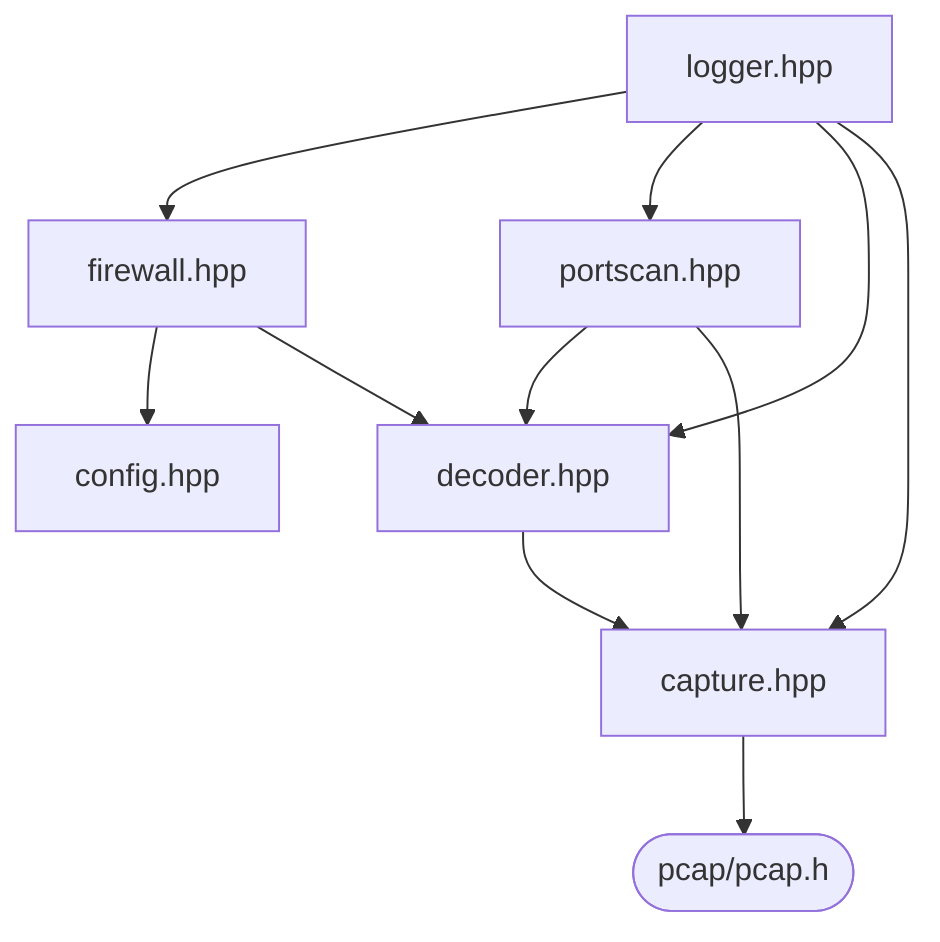
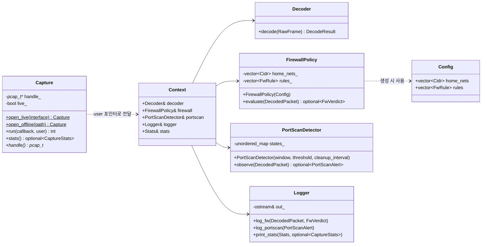
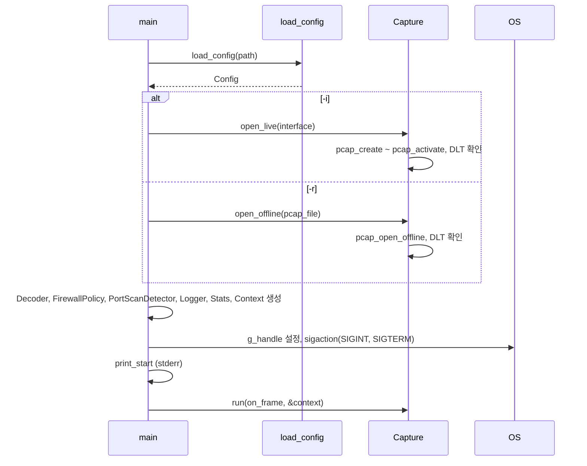
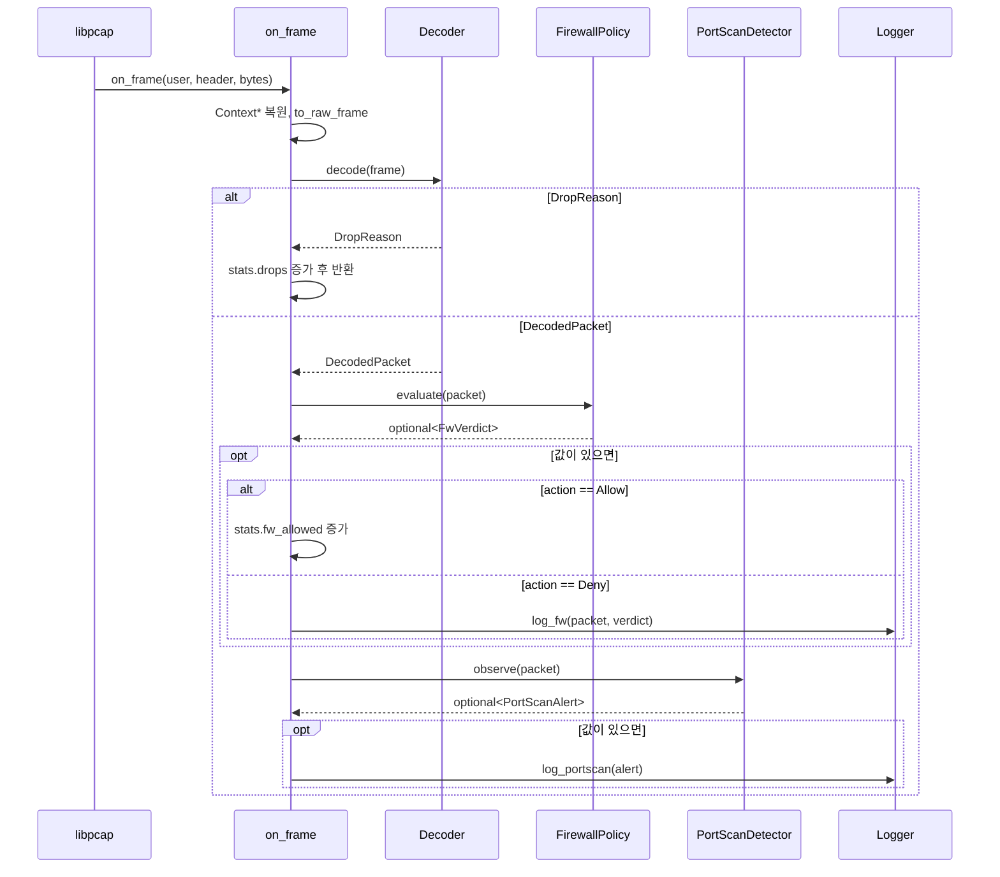
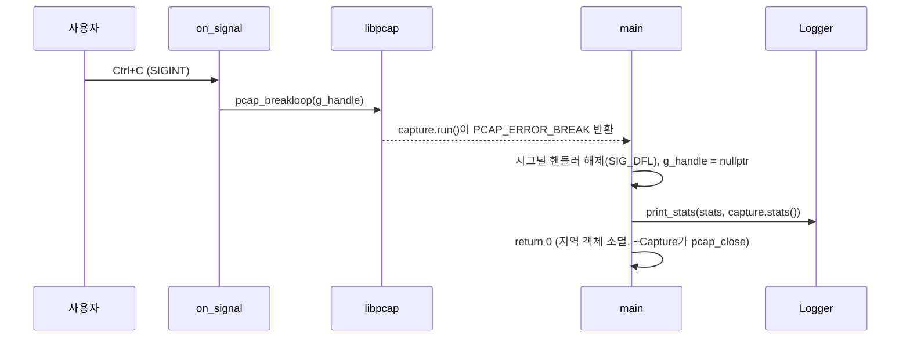

# Mini UTM Spec

이 문서는 Mini UTM의 코드 구조, 즉 파일 구성, 클래스와 메서드, 클래스 간의 관계,
그리고 호출 흐름에 관하여 기술한다. 각 Component가 **무엇을, 왜** 하는지는
[DESIGN.md](DESIGN.md)에 기술하며, 이 문서는 그것을 **코드로 어떻게 구성하는지**를 다룬다.

## 목차

- [1. 구조 원칙](#1-구조-원칙)
- [2. 파일 구성](#2-파일-구성)
  - [2.1 include 관계](#21-include-관계)
- [3. 클래스 다이어그램](#3-클래스-다이어그램)
- [4. 데이터 타입](#4-데이터-타입)
- [5. 클래스 명세](#5-클래스-명세)
  - [5.1 Config](#51-config)
  - [5.2 Capture](#52-capture)
  - [5.3 Decoder](#53-decoder)
  - [5.4 FirewallPolicy](#54-firewallpolicy)
  - [5.5 PortScanDetector](#55-portscandetector)
  - [5.6 Logger](#56-logger)
- [6. main](#6-main)
  - [6.1 전역 상태](#61-전역-상태)
  - [6.2 Context](#62-context)
  - [6.3 main 함수](#63-main-함수)
  - [6.4 on_frame 콜백](#64-on_frame-콜백)
  - [6.5 시그널 핸들러](#65-시그널-핸들러)
- [7. 호출 흐름](#7-호출-흐름)
  - [7.1 시작](#71-시작)
  - [7.2 프레임 처리](#72-프레임-처리)
  - [7.3 종료](#73-종료)
- [8. 에러 처리](#8-에러-처리)

## 1. 구조 원칙

| 원칙                          | 내용                                                                                                                                                                          |
| ----------------------------- | ----------------------------------------------------------------------------------------------------------------------------------------------------------------------------- |
| 흐름은 콜백이 지휘한다        | 프레임 하나의 처리 순서(해석 → 방화벽 → 포트 스캔 → 로그)는 `main.cpp`의 `on_frame` 콜백이 차례로 호출하여 결정한다. 별도의 지휘 클래스를 두지 않는다.                        |
| 탐지기는 결과만 반환한다      | `FirewallPolicy`와 `PortScanDetector`는 `Logger`를 알지 못하며 판정 결과를 반환값으로 돌려준다. 로그 출력은 `on_frame`이 결과를 받아 `Logger`에 넘긴다.                       |
| 해석 실패는 반환값으로 알린다 | `Decoder`는 해석에 실패해도 예외를 던지지 않고 `std::variant<DecodedPacket, DropReason>`로 제외 사유를 반환한다. 해석 실패는 초당 수없이 일어나는 정상적인 결과이기 때문이다. |
| 초기화 실패는 예외로 알린다   | 설정 파일 오류, 캡처 초기화 실패처럼 시작 시 한 번 일어나고 계속 진행할 수 없는 실패는 `std::runtime_error`를 던지며, `main`이 받아 메시지를 출력하고 종료한다.               |
| 전역 상태는 최소로 둔다       | 객체는 `main`이 소유하고 `on_frame`에는 libpcap의 user 포인터로 전달한다. 전역 변수는 시그널 핸들러가 사용하는 `pcap_t*` 하나뿐이다.                                          |

언어 표준은 C++20이다(`std::variant`, `std::optional`, `std::span` 사용). g++ 11 이상, CMake 3.20 이상으로 빌드한다.
libpcap은 pkg-config로, Catch2(v2)는 `find_package`로 찾는다.

```text
cmake -S . -B build          # 처음 한 번 (빌드 설정 생성)
cmake --build build          # 빌드: build/mini_utm, build/unit_tests
ctest --test-dir build       # 테스트 실행 (프로젝트 루트를 작업 디렉터리로 실행)
```

## 2. 파일 구성

| 파일                                    | 내용                                                                                         |
| --------------------------------------- | -------------------------------------------------------------------------------------------- |
| `src/main.cpp`                          | `main`, `Context`, `Options`, `parse_options`, `print_usage`, `on_frame` 콜백, `on_signal`, `set_signal_handler` |
| `src/capture.hpp` / `src/capture.cpp`   | `Capture`, `RawFrame`, `CaptureStats`, `to_raw_frame`, 시간 타입 별칭                        |
| `src/decoder.hpp` / `src/decoder.cpp`   | `Decoder`, `DecodedPacket`, `MacAddress`, `DropReason`, `kDropReasonCount`, `DecodeResult`, `to_string` |
| `src/config.hpp` / `src/config.cpp`     | `Cidr`, `FwAction`, `FwRule`, `Config`, `load_config`                                        |
| `src/firewall.hpp` / `src/firewall.cpp` | `FirewallPolicy`, `Direction`, `FwVerdict`                                                   |
| `src/portscan.hpp` / `src/portscan.cpp` | `PortScanDetector`, `PortScanAlert`                                                          |
| `src/logger.hpp` / `src/logger.cpp`     | `Logger`, `Stats`                                                                            |
| `docs/DESIGN.md`, `docs/SPEC.md`        | 설계 문서                                                                                    |
| `tests/test_main.cpp`                   | Catch2 테스트 실행 파일의 `main` (`CATCH_CONFIG_MAIN`)                                       |
| `tests/capture_test.cpp`                | `Capture`, `to_raw_frame` 테스트                                                             |
| `tests/decoder_test.cpp`                | `Decoder`, `to_string` 테스트                                                                |
| `tests/data/`                           | 테스트 입력 pcap 파일                                                                        |
| `config/mini_utm.conf`                  | 설정 파일 예시                                                                               |
| `CMakeLists.txt`                        | 빌드 설정. `mini_utm_core`(main.cpp를 뺀 본체, 정적 라이브러리), `mini_utm`, `unit_tests`   |

Component 사이를 오가는 데이터 타입은 공용 헤더에 모으지 않고, 그 타입을 만드는 Component의 헤더에 정의한다.
사용하는 쪽은 그 헤더를 include한다. 예외는 다음 두 가지이다.

- `FwAction`은 `FwRule`과 `FwVerdict`가 함께 사용한다. `firewall.hpp`가 `config.hpp`를 include하므로,
  `firewall.hpp`에 두면 순환 include가 생긴다. 따라서 `config.hpp`에 둔다.
- `Stats`는 `on_frame`이 채우지만 `main.cpp`는 헤더가 아니어서 다른 파일이 include할 수 없다.
  따라서 출력하는 쪽인 `logger.hpp`에 둔다.

### 2.1 include 관계

화살표는 "include한다"는 방향이다. `main.cpp`는 모든 헤더를 include하므로 그림에서 생략한다.



- 각 헤더는 그림에서 자기보다 아래에 있는 헤더만 include한다. 따라서 순환 include가 없다.
- 사용하는 헤더는 다른 헤더를 통해 딸려 오더라도 직접 include한다(Include What You Use).
  예를 들어 `logger.hpp`는 `firewall.hpp`를 통해 `decoder.hpp`를 얻을 수 있지만 직접 include한다.
  `portscan.hpp`가 `capture.hpp`를 include하는 것도 시간 타입 별칭(`TimePoint`, `Duration`)을 직접 사용하기 때문이다.
- 모든 헤더는 `#pragma once`로 여러 번 include되어도 한 번만 포함되게 한다.

## 3. 클래스 다이어그램



- `FirewallPolicy`, `PortScanDetector`와 `Logger` 사이에는 관계가 없다. 탐지기는 결과를 반환할 뿐
  로그를 출력하지 않는다([1장](#1-구조-원칙)).
- 모든 객체는 `main` 함수의 지역 변수로 생성되며, `main`이 반환할 때 소멸한다.

## 4. 데이터 타입

각 타입은 "정의 위치"의 헤더에 정의한다([2장](#2-파일-구성)). 필드의 의미는 DESIGN.md의 해당 절을 따른다.

| 타입            | 종류       | 정의 위치      | 생산자 → 소비자               | 필드 / 값                                                                                                              | 참조                                       |
| --------------- | ---------- | -------------- | ----------------------------- | ---------------------------------------------------------------------------------------------------------------------- | ------------------------------------------ |
| `RawFrame`      | struct     | `capture.hpp`  | `to_raw_frame` → `Decoder`    | `timestamp`(`TimePoint`), `bytes`(`std::span<const std::uint8_t>`, 크기가 캡처 길이)                                   | [DESIGN 3장](DESIGN.md#3-capture)          |
| `DecodedPacket` | struct     | `decoder.hpp`  | `Decoder` → 탐지기, `Logger`  | `timestamp`(`TimePoint`), `src_ip`·`dst_ip`(`std::uint32_t`, 호스트 바이트 순서), `src_port`·`dst_port`(`std::uint16_t`) | [DESIGN 4.4](DESIGN.md#44-decodedpacket)   |
| `MacAddress`    | struct     | `decoder.hpp`  | `decode_ethernet` → `EthernetFields` (`decoder.cpp` 내부) | `bytes`(`std::array<std::uint8_t, 6>`, 이더넷 헤더의 바이트 순서 그대로). `==` 비교를 제공한다. 다른 6바이트 값과 섞여 쓰이지 않도록 별도 타입으로 둔다 | [DESIGN 4.4](DESIGN.md#44-decodedpacket)   |
| `DropReason`    | enum class | `decoder.hpp`  | `Decoder` → `on_frame`        | `TruncatedEthernet`, `NotIpv4`, `TruncatedIpv4`, `InvalidIpv4`, `NotTcp`, `Ipv4Fragment`, `TruncatedTcp`, `InvalidTcp`, `NotConnectionAttempt` | [DESIGN 4장](DESIGN.md#4-decoder)          |
| `DecodeResult`  | 별칭       | `decoder.hpp`  | `Decoder` → `on_frame`        | `std::variant<DecodedPacket, DropReason>`                                                                              |                                            |
| `FwAction`      | enum class | `config.hpp`   |                               | `Allow`, `Deny`                                                                                                        | [DESIGN 5.1](DESIGN.md#51-firewall-policy) |
| `Direction`     | enum class | `firewall.hpp` |                               | `Inbound`, `Outbound`                                                                                                  | [DESIGN 5.1](DESIGN.md#51-firewall-policy) |
| `FwVerdict`     | struct     | `firewall.hpp` | `FirewallPolicy` → `Logger`   | `direction`, `rule_number`(`std::optional<std::size_t>`, 비어 있으면 기본 정책), `action`                              |                                            |
| `PortScanAlert` | struct     | `portscan.hpp` | `PortScanDetector` → `Logger` | `timestamp`, `src_ip`, `dst_ip`, `distinct_ports`, `window`                                                            |                                            |
| `Stats`         | struct     | `logger.hpp`   | `on_frame` → `Logger`         | `frames`, `decoded`, `drops`(`DropReason`별 개수 배열), `fw_logs`, `fw_allowed`, `portscan_logs`                       | [DESIGN 6장](DESIGN.md#6-logging)          |
| `CaptureStats`  | struct     | `capture.hpp`  | `Capture` → `Logger`          | `received`, `dropped`(`pcap_stats`의 `ps_recv`, `ps_drop`). 실시간 캡처에서만 생성된다.                                | [DESIGN 6장](DESIGN.md#6-logging)          |

`RawFrame::bytes`는 복사본이 아니라 libpcap 내부 버퍼를 가리킨다. libpcap은 콜백이 반환되면
이 버퍼를 다음 프레임에 재사용하므로, `bytes`는 `on_frame`이 반환될 때까지만 유효하다.
따라서 `RawFrame`을 보관하지 않으며, 이후 단계에 필요한 값은 `Decoder`가 `DecodedPacket`에 복사한다.

`DecodedPacket`의 IP는 비교와 CIDR 연산(`Cidr::contains`)을 바로 할 수 있도록 호스트 바이트 순서로 변환하여 저장한다.

시간 타입 별칭은 `capture.hpp`에 정의한다. 캡처 시각이 처음 만들어지는 곳이 `Capture`이기 때문이다.

| 별칭        | 정의                                   |
| ----------- | -------------------------------------- |
| `Clock`     | `std::chrono::system_clock`            |
| `TimePoint` | `Clock::time_point`                    |
| `Duration`  | `Clock::duration`                      |

보조 함수와 상수:

| 이름                                | 정의 위치                         | 설명                                                                                               |
| ----------------------------------- | --------------------------------- | -------------------------------------------------------------------------------------------------- |
| `const char* to_string(DropReason)` | `decoder.hpp` 선언, `decoder.cpp` 정의 | 로그·통계 출력용 이름(`"truncated_tcp"` 등)을 반환한다.                                       |
| `kDropReasonCount`                  | `decoder.hpp`                     | `DropReason`의 개수. `Stats::drops` 배열의 크기로 쓴다. `DropReason`의 마지막 값에서 계산한다.     |

## 5. 클래스 명세

### 5.1 Config

설정 파일의 내용을 담는 구조체와 이를 읽는 함수이다.

| 타입     | 필드                                                             | 설명                                                             |
| -------- | ---------------------------------------------------------------- | ---------------------------------------------------------------- |
| `Cidr`   | `network`, `mask` (`std::uint32_t`)                              | 내부망 대역. `bool contains(std::uint32_t ip) const`를 제공한다. |
| `FwRule` | `action`, `ip`, `port`                                           | `fw` 줄 하나                                                     |
| `Config` | `home_nets`(`std::vector<Cidr>`), `rules`(`std::vector<FwRule>`) | 설정 파일 전체                                                   |

| 함수                                          | 입력           | 출력     | 실패 시                                                                                        |
| --------------------------------------------- | -------------- | -------- | ---------------------------------------------------------------------------------------------- |
| `Config load_config(const std::string& path)` | 설정 파일 경로 | `Config` | 파일을 열 수 없거나 문법에 맞지 않는 줄이 있으면 줄 번호를 담아 `std::runtime_error`를 던진다. |

`rules`는 파일에 기술된 순서를 유지한다. First Match와 로그의 `rule=#<번호>`가 이 순서에 의존한다.

파일에 `home_net` 줄이 하나도 없으면 `load_config`는 `home_nets`를 RFC 1918 사설 대역
(`10.0.0.0/8`, `172.16.0.0/12`, `192.168.0.0/16`)으로 채운다([DESIGN 5.1 기본 내부망 대역](DESIGN.md#기본-내부망-대역)).
따라서 `FirewallPolicy`는 `home_nets`가 비어 있는 경우를 고려하지 않는다.

### 5.2 Capture

libpcap 핸들을 소유하는 클래스이다. 정적 생성 함수에서 핸들을 열고 소멸자에서 닫는다(RAII).
핸들이 두 번 닫히지 않도록 복사를 금지하고, 정적 생성 함수가 값을 반환할 수 있도록 이동은 허용한다.
이동된 쪽의 `handle_`은 `nullptr`로 만들어 소멸자가 닫지 않게 한다.

두 입력 소스는 모두 `std::string` 하나를 받으므로 생성자 오버로딩으로는 구분할 수 없다.
따라서 생성자를 private으로 두고 이름이 있는 정적 생성 함수로 구분한다.

| 메서드                                                     | 입력              | 출력                                | 설명                                                                                                                                                  |
| ---------------------------------------------------------- | ----------------- | ----------------------------------- | ----------------------------------------------------------------------------------------------------------------------------------------------------- |
| `static Capture open_live(const std::string& interface)`   | 인터페이스 이름   | `Capture`                           | 아래 [초기화 순서](#open_live-초기화-순서)를 수행한다. 실패하거나 링크 계층이 `DLT_EN10MB`가 아니면 `std::runtime_error`를 던진다. `pcap_activate`가 경고(양수)를 반환하면 `stderr`에 경고를 출력하고 계속 진행한다. |
| `static Capture open_offline(const std::string& path)`     | pcap 파일 경로    | `Capture`                           | `pcap_open_offline`으로 파일을 연다. 실패하거나 링크 계층이 `DLT_EN10MB`가 아니면 `std::runtime_error`를 던진다.                                     |
| `~Capture()`                                               |                   |                                     | `handle_`이 `nullptr`가 아니면 `pcap_close`를 호출한다.                                                                                               |
| `int run(pcap_handler callback, u_char* user)`             | 콜백, user 포인터 | `pcap_loop`의 반환값                | `pcap_loop(handle_, -1, callback, user)`를 호출한다. 파일 끝이면 `0`, `pcap_breakloop`로 중단되면 `PCAP_ERROR_BREAK`(-2), 오류면 `PCAP_ERROR`(-1). |
| `std::optional<CaptureStats> stats() const`                |                   | `CaptureStats` 또는 비어 있음       | 실시간 캡처이면 `pcap_stats`를 호출한다. 파일 재생이거나 `pcap_stats`가 실패하면 비어 있는 값을 반환한다.                                           |
| `pcap_t* handle() const`                                   |                   | `pcap_t*`                           | 시그널 핸들러에 전달하기 위한 핸들이다.                                                                                                               |

`pcap_stats`는 libpcap이 캡처를 시작한 뒤 커널로부터 집계한 값을 조회하는 함수이다. 따라서 종료 시점에
한 번 호출하면 실행 기간 전체의 수신 수(`ps_recv`)와 누락 수(`ps_drop`)를 얻는다.

#### open_live 초기화 순서

`pcap_open_live`는 커널 캡처 버퍼 크기를 지정할 수 없으므로, `pcap_create`로 핸들을 만들고 설정한 뒤
`pcap_activate`로 활성화한다. 설정값과 그 이유는 [DESIGN 3장 실시간 캡처 설정](DESIGN.md#실시간-캡처-설정)을 따른다.

| 순서 | 함수                   | 설정값                  |
| ---- | ---------------------- | ----------------------- |
| 1    | `pcap_create`          | 인터페이스 이름         |
| 2    | `pcap_set_snaplen`     | 65535                   |
| 3    | `pcap_set_promisc`     | 1                       |
| 4    | `pcap_set_timeout`     | 100 (ms)                |
| 5    | `pcap_set_buffer_size` | 64MB                    |
| 6    | `pcap_activate`        | —                       |
| 7    | `pcap_datalink`        | `DLT_EN10MB`인지 확인   |

`open_offline`은 `pcap_open_offline`으로 연 뒤 7단계만 수행한다. `DLT_EN10MB`는 libpcap이 이더넷 링크 계층을 나타내는 상수이다.

자유 함수:

| 함수                                                                    | 설명                                                                                                                                |
| ----------------------------------------------------------------------- | ----------------------------------------------------------------------------------------------------------------------------------- |
| `RawFrame to_raw_frame(const pcap_pkthdr* header, const u_char* bytes)` | libpcap이 전달한 헤더와 바이트로 `RawFrame`을 만든다. `header->ts`(`timeval`)를 `std::chrono::system_clock::time_point`로 변환하고, `bytes`와 `header->caplen`으로 `std::span`을 만든다. |

### 5.3 Decoder

상태를 갖지 않는 클래스이다.

| 메서드                                             | 입력       | 출력                              | 설명                                                                                |
| -------------------------------------------------- | ---------- | --------------------------------- | ----------------------------------------------------------------------------------- |
| `DecodeResult decode(const RawFrame& frame) const` | `RawFrame` | `DecodedPacket` 또는 `DropReason` | [DESIGN 4장](DESIGN.md#4-decoder)의 검사를 순서대로 수행한다. 예외를 던지지 않는다. |

계층별 해석은 `decoder.cpp`의 익명 namespace 함수로 나눈다. `Decoder`는 상태가 없어 이 함수들이
객체를 사용하지 않으므로 private 메서드로 두지 않는다. 이렇게 하면 계층 함수와 중간 결과 구조체가
헤더에 드러나지 않고, 이를 바꾸어도 `decoder.cpp`만 다시 컴파일된다.

각 함수는 앞 계층이 넘긴 남은 바이트 범위(`Bytes` = `std::span<const std::uint8_t>`)만 읽고,
성공하면 다음 계층에 넘길 값을, 실패하면 `DropReason`을 `std::variant`로 반환한다.
`decode`는 세 함수를 차례로 호출하고 첫 `DropReason`을 그대로 반환한다.

| 함수 (`decoder.cpp` 내부)                                          | 대응                                       | 성공 시 반환                                                                 |
| ------------------------------------------------------------------ | ------------------------------------------ | ---------------------------------------------------------------------------- |
| `std::variant<EthernetFields, DropReason> decode_ethernet(Bytes frame)` | [DESIGN 4.1](DESIGN.md#41-decode-ethernet) | 목적지·출발지 MAC, IPv4 헤더부터 프레임 끝까지의 범위                        |
| `std::variant<Ipv4Fields, DropReason> decode_ipv4(Bytes ip)`       | [DESIGN 4.2](DESIGN.md#42-decode-ipv4)     | 출발지·목적지 IP(호스트 바이트 순서), TCP 헤더부터 Total Length 끝까지의 범위(`Total Length − IHL × 4`) |
| `std::variant<TcpFields, DropReason> decode_tcp(Bytes tcp)`        | [DESIGN 4.3](DESIGN.md#43-decode-tcp)      | 출발지·목적지 Port. 연결 시도 패킷이 아니면 `NotConnectionAttempt`           |

다중 바이트 필드는 같은 파일의 `read_u16`, `read_u32`로 Big Endian 값을 읽어 호스트 바이트 순서 정수로 만든다.
호출 전에 길이를 확인하므로 이 함수들은 범위를 검사하지 않는다.

`to_string`은 `default` 없는 `switch`로 작성한다. `DropReason`에 값이 추가되었는데 이름을 빠뜨리면
`-Wswitch` 경고가 발생한다.

### 5.4 FirewallPolicy

| 메서드                                                                 | 입력           | 출력                                               | 설명                                                                              |
| ---------------------------------------------------------------------- | -------------- | -------------------------------------------------- | --------------------------------------------------------------------------------- |
| `explicit FirewallPolicy(const Config& config)`                        | `Config`       |                                                    | `home_nets`와 `rules`를 복사하여 보관한다.                                        |
| `std::optional<FwVerdict> evaluate(const DecodedPacket& packet) const` | 연결 시도 패킷 | 정책에 일치했거나 Inbound 기본 Deny이면 `FwVerdict`, 아니면 비어 있음 | [DESIGN 5.1](DESIGN.md#51-firewall-policy)의 매칭 규칙을 따른다. 로그 출력 여부는 `on_frame`이 `action`으로 결정한다. |

`evaluate`가 비어 있는 값을 반환하는 경우:

- 방향 판별 결과가 판단 대상이 아닌 경우(내부↔내부, 외부↔외부)
- Outbound 트래픽이 어떤 정책에도 일치하지 않은 경우(기본 Allow, 로그 없음)

| private 메서드                                                      | 설명                                            |
| ------------------------------------------------------------------- | ----------------------------------------------- |
| `bool is_home(std::uint32_t ip) const`                              | `home_nets_` 중 하나라도 `ip`를 포함하면 `true` |
| `std::optional<Direction> direction_of(const DecodedPacket&) const` | 판단 대상이 아니면 비어 있는 값                 |

### 5.5 PortScanDetector

| 메서드                                                                                | 입력                           | 출력                                                            | 설명                                                             |
| ------------------------------------------------------------------------------------- | ------------------------------ | --------------------------------------------------------------- | ---------------------------------------------------------------- |
| `PortScanDetector(Duration window, std::size_t threshold, Duration cleanup_interval)` | 윈도우, 임계값, 상태 정리 주기 |                                                                 | 인자를 각각 `window_`, `threshold_`, `cleanup_interval_`에 보관한다. |
| `std::optional<PortScanAlert> observe(const DecodedPacket& packet)`                   | 연결 시도 패킷                 | 이번 패킷으로 스캔이 탐지되면 `PortScanAlert`, 아니면 비어 있음 | [DESIGN 5.2](DESIGN.md#52-port-scan-detector)의 절차를 수행한다. |

| 멤버                | 타입                                                  | 설명                                                         |
| ------------------- | ----------------------------------------------------- | ------------------------------------------------------------ |
| `window_`           | `Duration`                                            | 집계 시간 윈도우 (`main`에서 1초)                            |
| `threshold_`        | `std::size_t`                                         | 탐지에 필요한 서로 다른 목적지 Port 수 (`main`에서 10)       |
| `cleanup_interval_` | `Duration`                                            | 상태 정리 주기 (`main`에서 10초)                             |
| `states_`           | `std::unordered_map<PairKey, PairState, PairKeyHash>` | `(src_ip, dst_ip)`별 상태                                    |
| `last_timestamp_`   | `TimePoint`                                           | 시각 역행 보정에 사용하는, 지금까지 처리한 가장 큰 캡처 시각 |
| `last_cleanup_`     | `TimePoint`                                           | 마지막으로 상태를 정리한 시각                                |

파라미터를 생성자로 받는 이유는 테스트에서 작은 윈도우·임계값으로 동작을 확인할 수 있게 하기 위해서이다.
기본값은 [DESIGN 5.2](DESIGN.md#탐지-규칙)를 따르며 `main`이 전달한다.

| 내부 타입     | 설명                                                                           |
| ------------- | ------------------------------------------------------------------------------ |
| `PairKey`     | `src_ip`, `dst_ip`                                                             |
| `PairKeyHash` | `PairKey`를 `std::unordered_map`의 키로 쓰기 위한 해시 함수 객체               |
| `PairState`   | 아래 표 ([DESIGN 5.2 자료구조](DESIGN.md#자료구조))                            |

| `PairState` 필드 | 타입                                               |
| ---------------- | -------------------------------------------------- |
| `events`         | `std::deque<std::pair<TimePoint, std::uint16_t>>`  |
| `port_counts`    | `std::unordered_map<std::uint16_t, std::uint32_t>` |
| `alerted`        | `bool`                                             |

`events`는 앞에서 제거하고 뒤에 추가하므로 양쪽 끝의 삽입·삭제가 상수 시간인 `std::deque`를 사용한다.

`observe`의 처리 순서:

1. `t = max(packet.timestamp, last_timestamp_)`로 보정하고 `last_timestamp_`를 갱신한다.
2. `t − last_cleanup_ >= cleanup_interval`이면 `cleanup(t)`를 호출한다.
3. 키에 해당하는 `PairState`에 대하여 슬라이딩 윈도우 절차를 수행한다.

| private 메서드                                | 설명                                                       |
| --------------------------------------------- | ---------------------------------------------------------- |
| `void expire(PairState& state, TimePoint t)`  | 윈도우를 벗어난 기록을 앞쪽부터 제거한다(절차 1).          |
| `void cleanup(TimePoint t)`                   | 모든 키에 `expire`를 적용하고 `events`가 빈 키를 삭제한다. |

### 5.6 Logger

| 메서드                                                | 입력        | 설명                                                                                                    |
| ----------------------------------------------------- | ----------- | ------------------------------------------------------------------------------------------------------- |
| `explicit Logger(std::ostream& out)`                  | 출력 스트림 | 실행 시에는 `std::cout`을 전달한다. 테스트에서는 `std::ostringstream`을 전달하여 출력을 확인할 수 있다. |
| `void log_fw(const DecodedPacket&, const FwVerdict&)` | 패킷, 판정  | `[FW]` 로그 한 줄을 출력한다.                                                                           |
| `void log_portscan(const PortScanAlert&)`             | 경보        | `[PORTSCAN]` 로그 한 줄을 출력한다.                                                                     |
| `void print_stats(const Stats&, const std::optional<CaptureStats>&)` | 통계 | 종료 통계를 출력한다. `CaptureStats`가 비어 있으면 커널 수신·누락 수를 출력하지 않는다.       |

로그 형식은 [DESIGN 6장](DESIGN.md#6-logging)을 따른다. 시각은 로그에 담긴 캡처 시각을 사용한다.

## 6. main

### 6.1 전역 상태

| 변수       | 타입      | 설명                                                                                                                                         |
| ---------- | --------- | -------------------------------------------------------------------------------------------------------------------------------------------- |
| `g_handle` | `pcap_t*` | 시그널 핸들러가 `pcap_breakloop`에 전달할 핸들. 시그널 핸들러는 인자를 받을 수 없으므로 전역에 둔다. 시그널 핸들러를 등록하기 전에 설정하고, `capture.run`이 반환되면 핸들러를 해제한 뒤 `nullptr`로 비운다. |

### 6.2 Context

`on_frame`이 사용할 객체들을 묶은 구조체이다. `main`의 지역 변수로 만들고, 그 주소를
`Capture::run`의 user 포인터로 전달한다.

```cpp
struct Context {
    const Decoder& decoder;
    const FirewallPolicy& firewall;
    PortScanDetector& portscan;
    Logger& logger;
    Stats& stats;
};
```

### 6.3 main 함수

#### 명령행 해석

명령행 형식은 [DESIGN 2.3 실행](DESIGN.md#실행)을 따른다. 해석 결과는 다음 구조체에 담는다.

| `Options` 필드 | 타입          | 설명                                    |
| -------------- | ------------- | --------------------------------------- |
| `live`         | `bool`        | `-i`이면 `true`, `-r`이면 `false`       |
| `source`       | `std::string` | 인터페이스 이름 또는 pcap 파일 경로     |
| `config_file`  | `std::string` | `-c`로 받은 설정 파일 경로              |

| 함수                                                       | 설명                                                                                          |
| ---------------------------------------------------------- | --------------------------------------------------------------------------------------------- |
| `std::optional<Options> parse_options(int argc, char* argv[])` | `getopt(argc, argv, "i:r:c:")`로 옵션을 읽는다. 옵션 문자 뒤의 `:`는 값이 따라온다는 뜻이다. 다음 경우 비어 있는 값을 반환한다. |
| `void print_usage(const char* prog)`                       | 두 가지 실행 형식을 `stderr`에 출력한다. `prog`는 `argv[0]`(실행한 프로그램 이름)이다.       |
| `void print_start(const Options& opts, const Config& config)` | 시작 메시지를 `stderr`에 출력한다. 아래 참고. |

`parse_options`가 비어 있는 값을 반환하는 경우:

- 알 수 없는 옵션이 있거나 옵션의 값이 빠진 경우 (`getopt`가 `'?'`를 반환)
- `-i`와 `-r`이 둘 다 있거나 둘 다 없는 경우 (`has_i == has_r`)
- `-c`가 없는 경우
- 옵션 뒤에 남는 인자가 있는 경우 (`optind != argc`)

#### 처리 순서

1. `parse_options`로 인자를 해석한다. 비어 있는 값이면 `print_usage`를 호출하고 `1`을 반환한다.
2. `load_config(config_file)`로 `Config`를 만든다.
3. `-i`이면 `Capture::open_live(interface)`, `-r`이면 `Capture::open_offline(pcap_file)`로 캡처를 초기화한다.
4. `Decoder`, `FirewallPolicy(config)`, `PortScanDetector(1s, 10, 10s)`, `Logger(std::cout)`, `Stats`를 만든다.
5. `Context`를 만든다.
6. `g_handle = capture.handle()`로 설정하고 `set_signal_handler(on_signal)`로 `SIGINT`, `SIGTERM` 핸들러를 등록한다.
7. `print_start(opts, config)`로 시작 메시지를 `stderr`에 출력한다.
8. `capture.run(on_frame, reinterpret_cast<u_char*>(&context))`를 호출한다. 이 호출은 파일 끝에 도달하거나 종료 시그널을 받을 때까지 반환하지 않는다.
9. `set_signal_handler(SIG_DFL)`로 `SIGINT`, `SIGTERM`의 처리를 기본 동작으로 되돌린 뒤 `g_handle = nullptr`로 비운다.
10. `logger.print_stats(stats, capture.stats())`로 종료 통계를 출력한다. `run`의 반환값이 `PCAP_ERROR_BREAK`(종료 시그널)이면 그 전에 `stderr`에 줄바꿈을 출력해, 터미널이 표시한 `^C` 뒤에 통계 첫 줄이 붙지 않게 한다.
11. `run`의 반환값이 `0` 또는 `PCAP_ERROR_BREAK`이면 `0`, `PCAP_ERROR`이면 오류 메시지를 출력하고 `1`을 반환한다.

9단계는 `Capture`가 소멸하기 전에 시그널 핸들러가 `g_handle`을 사용하지 않게 하기 위한 것이다.
이 단계가 없으면 `Capture` 소멸 후 시그널을 받을 때 이미 닫힌 핸들로 `pcap_breakloop`를 호출하게 된다.
핸들러를 먼저 해제하므로 `on_signal`이 `nullptr`인 `g_handle`을 보는 경우는 없다.
이후 받은 시그널은 기본 동작에 따라 프로세스를 즉시 종료하며, 종료 통계 출력 중이라면 출력이 중단된다.

7단계의 시작 메시지는 입력 소스와 적재한 설정의 개수를 보여 준다. 탐지 로그만 `stdout`에 남도록 `stderr`에 출력하며,
대응하는 패킷이 없으므로 시각을 붙이지 않는다. `-i`일 때만 종료 방법을 덧붙인다.

```text
mini_utm: capturing on eno6 (home_nets=3, rules=3). Press Ctrl+C to stop.
mini_utm: reading tests/data/sample.pcap (home_nets=3, rules=3)
```

2단계 이후 발생한 `std::runtime_error`는 `main`이 받아 메시지를 `stderr`에 출력하고 `1`을 반환한다.
예외를 던지는 곳은 `load_config`(2단계)와 `Capture`의 정적 생성 함수(3단계)이다.

### 6.4 on_frame 콜백

```cpp
void on_frame(u_char* user, const pcap_pkthdr* header, const u_char* bytes);
```

libpcap이 프레임마다 호출하는 C 콜백이다. 프레임 하나의 처리 순서를 결정한다.

1. `user`를 `Context*`로 되돌린다.
2. `stats.frames`를 증가시킨다.
3. `to_raw_frame(header, bytes)`로 `RawFrame`을 만든다.
4. `decoder.decode(frame)`을 호출한다. 결과가 `DropReason`이면 `stats.drops`의 해당 사유를 증가시키고 반환한다.
5. `stats.decoded`를 증가시킨다.
6. `firewall.evaluate(packet)`이 값을 반환하면, `action`이 `Allow`이면 `stats.fw_allowed`만 증가시키고,
   `Deny`이면 `logger.log_fw`를 호출하고 `stats.fw_logs`를 증가시킨다([DESIGN 5.1 동작](DESIGN.md#동작)).
7. `portscan.observe(packet)`이 값을 반환하면 `logger.log_portscan`을 호출하고 `stats.portscan_logs`를 증가시킨다.

6과 7은 서로 독립적이며, 한 패킷에 대해 두 로그가 모두 출력될 수 있다.

### 6.5 시그널 핸들러

```cpp
void on_signal(int signo);
```

`pcap_breakloop(g_handle)`만 호출한다.

- `pcap_loop`는 루프가 끝날 때까지 반환하지 않으므로, 종료 시그널은 핸들러가 루프를 중단시키는 방식으로 처리한다.
  `pcap_breakloop`는 플래그만 설정하므로 처리 중이던 `on_frame`은 끝까지 실행되고, 그 뒤 `pcap_loop`가
  `PCAP_ERROR_BREAK`(-2)를 반환한다([DESIGN 2.3 종료](DESIGN.md#종료)의 "처리 중이던 프레임을 마친 뒤 멈춘다").
- 시그널 핸들러는 프로그램의 어느 지점에서든 끼어들어 실행되므로, 핸들러 안에서는 async-signal-safe 함수만
  호출할 수 있다. `printf`, `std::cout`, 메모리 할당은 여기에 해당하지 않으므로 종료 통계 출력은 `main`에서 수행한다.
- 핸들러는 시그널 번호 외의 인자를 받을 수 없으므로 핸들을 전역 변수 `g_handle`로 전달한다([6.1](#61-전역-상태)).

```cpp
void set_signal_handler(void (*handler)(int));
```

`SIGINT`와 `SIGTERM`에 `handler`를 `sigaction`으로 등록한다. 등록([6.3](#63-main-함수) 6단계)과
해제(9단계, `SIG_DFL` 전달)에 같은 함수를 사용하여 두 시그널을 항상 함께 다룬다.
`signal` 대신 `sigaction`을 사용하는 이유는 `signal`의 동작(핸들러가 한 번 실행된 뒤 기본 동작으로
되돌아가는지 등)이 시스템마다 다르기 때문이다.

## 7. 호출 흐름

### 7.1 시작



### 7.2 프레임 처리



### 7.3 종료



## 8. 에러 처리

| 상황                                 | 발생 위치         | 전달 방식                           | 처리                                                       |
| ------------------------------------ | ----------------- | ----------------------------------- | ---------------------------------------------------------- |
| 인자 오류                            | `main`            | —                                   | 사용법 출력, 종료 코드 `1`                                 |
| 설정 파일을 열 수 없음, 문법 오류    | `load_config`     | `std::runtime_error` (줄 번호 포함) | `main`이 메시지 출력, 종료 코드 `1`                        |
| 캡처 초기화 실패, 이더넷이 아닌 링크 | `Capture::open_live`, `Capture::open_offline` | `std::runtime_error` | `main`이 메시지 출력, 종료 코드 `1`                  |
| 프레임 해석 실패                     | `Decoder::decode` | 반환값 `DropReason`                 | 사유별 카운터 증가 후 다음 프레임                          |
| 캡처 중 오류                         | `pcap_loop`       | 반환값 `PCAP_ERROR`                 | 종료 통계 출력 후 `pcap_geterr` 메시지 출력, 종료 코드 `1` |
| 재생 파일 끝                         | `pcap_loop`       | 반환값 `0`                          | 종료 통계 출력, 종료 코드 `0`                              |
| 종료 시그널                          | `on_signal`       | `pcap_breakloop`                    | 종료 통계 출력, 종료 코드 `0`                              |

`on_frame`은 C 라이브러리가 호출하는 함수이므로, 예외가 이 함수 밖으로 전파되어서는 안 된다.
`on_frame`이 호출하는 메서드는 예외를 던지지 않도록 작성한다.
